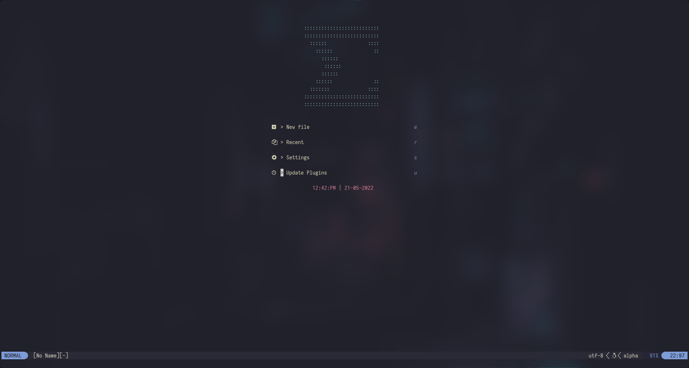
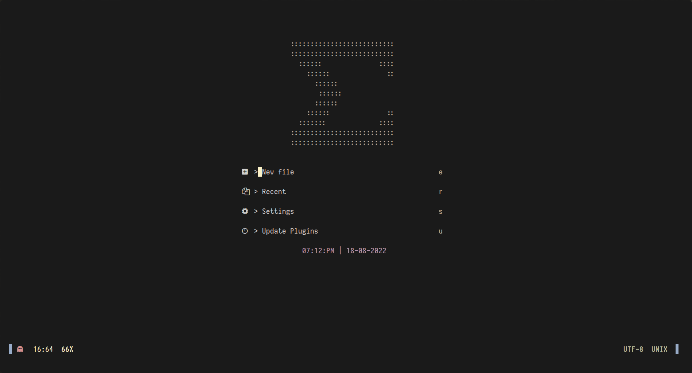

#  Sigma Nvim
###### in lua


# This is a WIP. Not complete (yet)

## Showcase

<sub>This is kanagawa theme<sub/>



### Theme changer depending on time of the day

## Plugins
- packer.nvim
  * [`wbthomason/packer.nvim`](https://github.com/wbthomason/packer.nvim)
- gruvbox-material
  * [`sainnhe/gruvbox-material`](https://github.com/sainnhe/gruvbox-material)
- kanagawa
  * [`rebelot/kanagawa.nvim`](https://github.com/rebelot/kanagawa.nvim)
- nerdcommenter
  * [`preservim/nerdcommenter`](https://github.com/preservim/nerdcommenter)
- lualine.nvim
  * [`nvim-lualine/lualine.nvim`](https://github.com/nvim-lualine/lualine.nvim)
- presence.nvim (altough this is just for discord users)
  * [`andweeb/presence.nvim`](https://github.com/andweeb/presence.nvim)
- nvim-web-devicons
  * [`kyazdani42/nvim-web-devicons`](https://github.com/kyazdani42/nvim-web-devicons)
- nvim-tree.lua
  * [`kyazdani42/nvim-tree.lua`](https://github.com/kyazdani42/nvim-tree.lua)
- telescope.nvim
  * [`nvim-telescope/telescope.nvim`](https://github.com/nvim-telescope/telescope.nvim)
    * It requieres [`nvim-lua/plenary.nvim`](https://github.com/nvim-lua/plenary.nvim)
- nvim-autopairs
  * [```windwp/nvim-autopairs```](https://github.com/windwp/nvim-autopairs)
- lspsaga.nvim
  * [`tami5/lspsaga.nvim`](https://github.com/tami5/lspsaga.nvim)
- lspkind-nvim
  * [`onsails/lspkind-nvim`](https://github.com/onsails/lspkind-nvim)
- completion-nvim
  * [`nvim-lua/completion-nvim`](https://github.com/nvim-lua/completion-nvim)
- nvim-cmp
  * [`hrsh7th/nvim-cmp`](https://github.com/hrsh7th/nvim-cmp)
    * It requires [`quangnguyen30192/cmp-nvim-tags`](https://github.com/quangnguyen30192/cmp-nvim-tags)
- symbols-outline.nvim
  * [`simrat39/symbols-outline.nvim`](https://github.com/simrat39/symbols-outline.nvim)
- cmp-nvim-lsp
  * [`hrsh7th/cmp-nvim-lsp`](https://github.com/hrsh7th/cmp-nvim-lsp)
- nvim-lspconfig
  * [`neovim/nvim-lspconfig`](https://github.com/neovim/nvim-lspconfig)
- nvim-colorizer.lua
  * [`norcalli/nvim-colorizer.lua`](https://github.com/norcalli/nvim-colorizer.lua)
- nvim-treesitter
  * [`nvim-treesitter/nvim-treesitter`](https://github.com/nvim-treesitter/nvim-treesitter)
- bufferline.nvim
  * [`akinsho/bufferline.nvim`](https://github.com/akinsho/bufferline.nvim)
    * It requires [`kyazdani42/nvim-web-devicons`](https://github.com/kyazdani42/nvim-web-devicons)
- indent-blankline.nvim
  * [`lukas-reineke/indent-blankline.nvim`](https://github.com/lukas-reineke/indent-blankline.nvim)
- goolord/alpha-nvim
  * [`goolord/alpha-nvim`](https://github.com/goolord/alpha-nvim)
- markdown-preview.nvim
  * [`iamcco/markdown-preview.nvim`](https://github.com/iamcco/markdown-preview.nvim)
- impatient.nvim
  * [`lewis6991/impatient.nvim`](https://github.com/lewis6991/impatient.nvim)
- filetype.nvim
  * [`nathom/filetype.nvim`](https://github.com/nathom/filetype.nvim)
- wildermenu.nvim
  * [`'gelguy/wilder.nvim'`](https://github.com/gelguy/wilder.nvim)

### Plugins disabled by default
- flutter-tools.nvim
  * [`akinsho/flutter-tools.nvim`](https://github.com/akinsho/flutter-tools.nvim)
- dart-vim-plugin
  * [`dart-lang/dart-vim-plugin`](https://github.com/dart-lang/dart-vim-plugin)
- LuaSnip
  * [`L3MON4D3/LuaSnip`](https://github.com/L3MON4D3/LuaSnip)
- zepl.vim
  * [`axvr/zepl.vim`](https://github.com/axvr/zepl.vim)
- yuck.vim
  * [`elkowar/yuck.vim`](https://github.com/elkowar/yuck.vim)

##  Important remaps
- ```leader key is the space bar```
- ```Control + h, j, k or l``` will serve as the movement keys for splits in normal mode.
- ```TAB``` will move you to the next tab.
- ```Shift + TAB``` will move you to the previous tab.
- ```Control + s``` will save your current buffer.
- ```Control + q``` will save and quit your vim sesion.
- ```Control + x``` will close the current buffer you are in but will not save your work.
- ```,,```          will bring a terminal at the bottom of the screen.
  * The terminal will be resized at just 20 for better screen space management.
  * This is usefull for C, C++ & Rust programing.
- ```leader + p```  will bring a BIG terminal window within the nvim instance.
  * This is usefull if you want to see most of the compilation errors/warnings more easily.
- ```Control + v``` will vertically split the window.
- ```Shift + h``` will horizontally split the window.
- ```Shift + k``` will bring a help menu in whatever happens you are positioned.

## Extras
- Shell script for changing the coloscheme depending on the hour of the day.
- Wallpapers to match the colorschemes

## TO-DO
- [x] Have a clean codebase <br>
- [x] Optimize it <br>
- [ ] Make the REAME better xd <br>
- [x] Lower start-up time to the minimum possible <br>
- [x] Add a logo or something to it <br>
 * [ ] Make the logo better <br>
